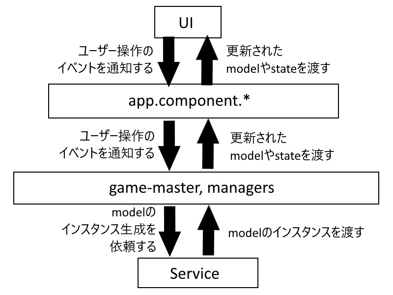

# ゲーム作り配信

## 自己紹介

名前はkyahhokid。一応現役WEBエンジニア。資格関連は特になし。

## ゲーム紹介

### ゲーム名
「勇者よ。焼きそばパンを買ってくるのじゃ。」

### このゲームを作ることになった経緯

1. 以前ウディタで魔王を倒すゲームを作ったことがあるから、今度は現代風のゲームを考えてみようかな。
1. どんな内容にしようか。コンビニにお使いに行く感じのゲームにしようか。
1. 何を買わせようか。そうだ、焼きそばパンでも買わせようか。
1. ちょっと待って、勇者に焼きそばパン買わせるゲームとか面白そうじゃないｗ？

### 概要

与えられたミッションをこなしていく感じのスタイルのゲームにする予定。

### プラットフォーム

Angular。理由は会社で使ってるプラットフォームがそれだから。いい機会だからコーディングの練習しようかなって。ちなみにゲームを作るのに向いてるプラットフォームとかではない。むしろ止めとけ。

### ファイル構成

* src
  * app
    * domain
      * model(何かと使い勝手のいいクラス群)
      * state(状態を管理するクラス群)
    * game-master
      * game-master.ts(ゲームの管理者)
      * managers(ゲームの管理者の部下達)
    * service(modelのインスタンス生成を行うクラス群。)
    * ui(画面のUIを構成する要素群)
    * app.component.*(全ての画面の親玉)
  * assets 
    * images(画像)

### アーキテクチャ

ざっくり以下のような内容。この図だとserviceもそこそこ働いてるように見えるけど、実際は初期化の際に一回呼び出されて終わりみたいな使われ方してる。基本はgame-masterとmanagerが状態の更新を担当してる。

